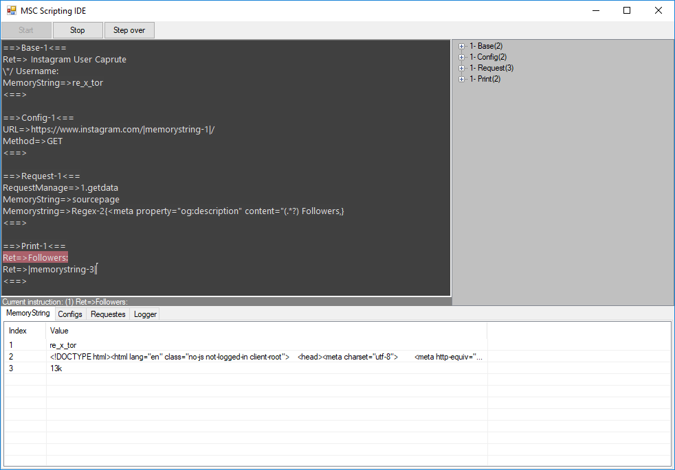
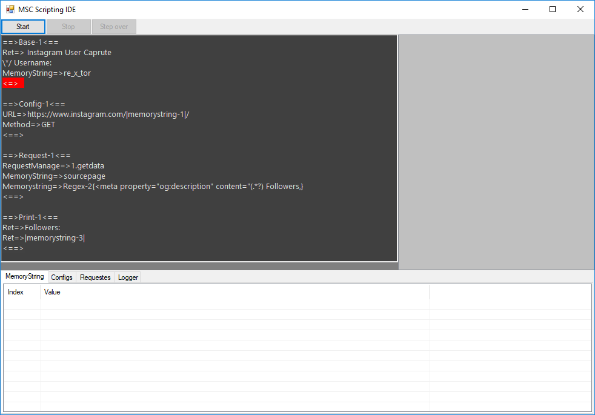

# MSC Scripting IDE
a full ide for sctipting in msc core
# Debugging
you can debug your codes and see and change config, request, memorystring values at runtime easily
- Compile codes (show errors of codes)

- Detecte bad instructions

- Debuge codes (line and line debugging)
- see and manage exception instructions

# show and edit varibels at runtime (configs, requests, memorystrings)
- Show and edit memorystring

- Show and edit config

- Show request manage

